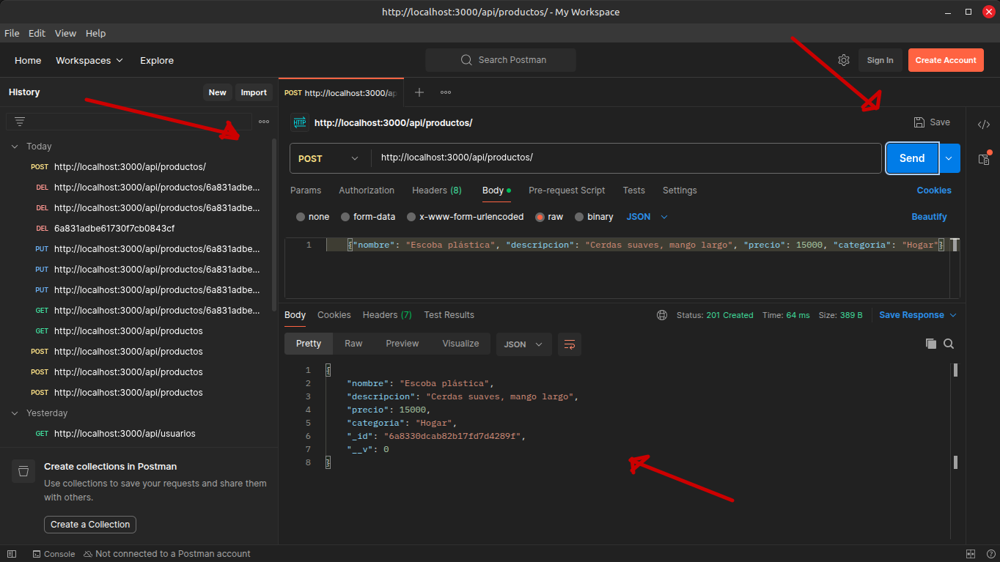
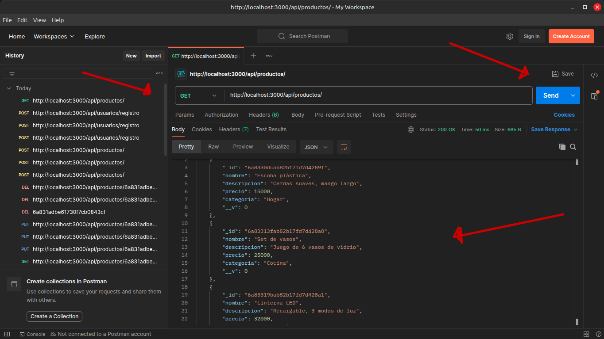
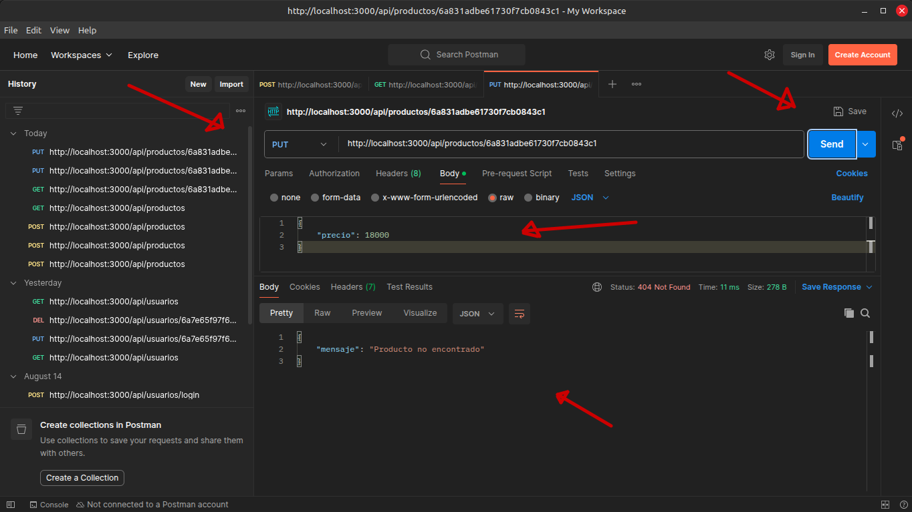
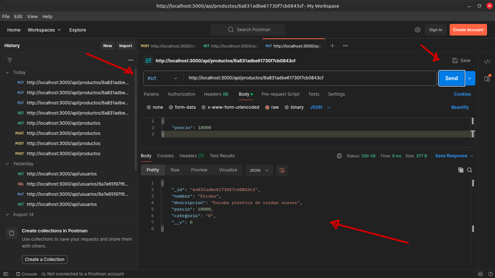
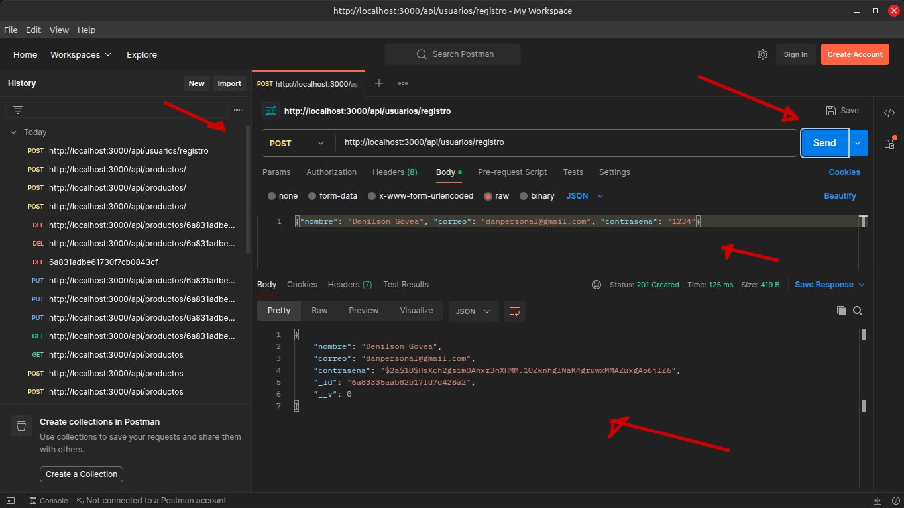
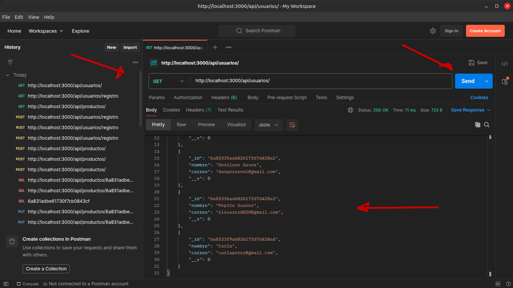
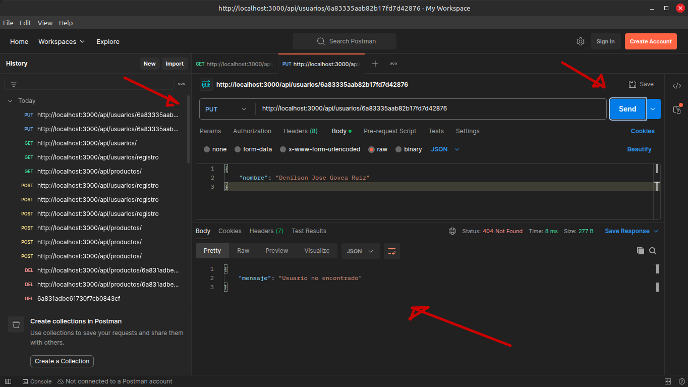
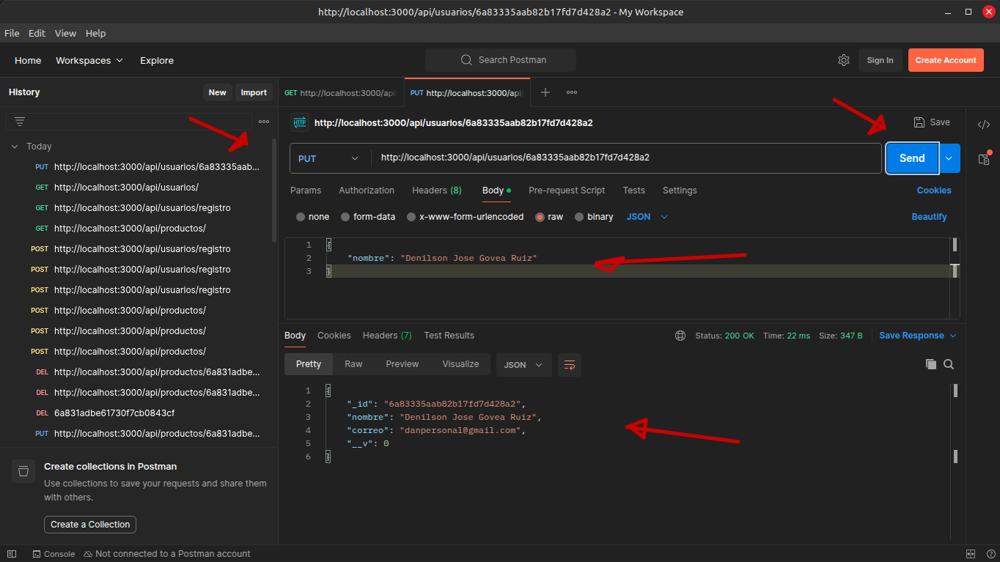
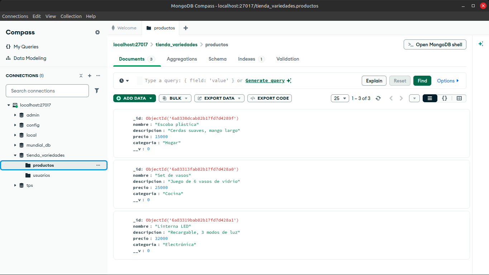
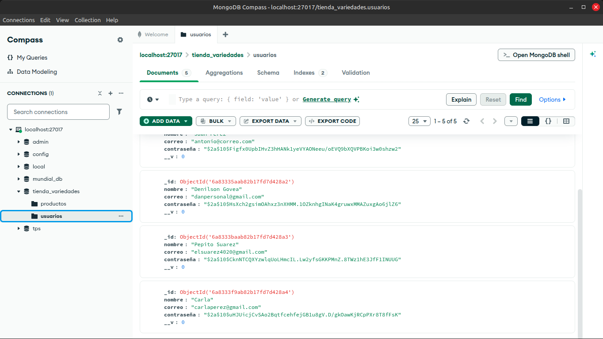

# Tienda de variedades API

Es una API REST para la gestión de una tienda de variedades (venta de productos varios, excluyendo ropa y alimentos). Permite el registro y autenticación de usuarios, así como la gestión completa de productos (CRUD). Esta API será utilizada como backend para una página web con inicio de sesión.

## Tecnologías utilizadas

- Node.js
- Express
- MongoDB
- Mongoose
- Dotenv
- JWT (JSON Web Token) para la autenticación
- bcrypt para encriptar las contraseñas
- Postman para realizar las pruebas 
- Git / Github para el control de versiones 

## Instalación 

1. Clonar el repositorio:
```bash
    git clone https://github.com/Denilson756/tienda-variedades-api.git
```
2. Entrar a la carpeta del proyecto:
```bash
    cd tienda-variedades-api
```
3. Instalar las dependencias:
```bash 
    npm install
```
4. Crear un archivo `.env` en la raíz del proyecto con las siguientes variables: 
MONGO_URI=mongodb://localhost:27017/tienda_variedades
PORT=3000

5. Ejecutar el servidor: 
```bash 
    node index.js
```
6. El servidor quedará disponible en `http://localhost:3000`

## Endpoints

### Usuarios - `/api/usuarios`

| Método | Endpoint               | Descripción                  | Requiere token  |
|--------|----------------------- |------------------------------|-----------------|
| POST   | /api/usuarios/registro | Registrar un nuevo usuario   |       No        |
| POST   | /api/usuarios/login    | Iniciar sesión               |       No        |
| GET    | /api/usuarios          | Obtener usuarios             |       No        |
| PUT    | /api/usuarios/:id      | Actualizar un usuario        |       No        |
| DELETE | /api/usuarios/:id      | Eliminar un usuario          |       No        |

### Productos — `/api/productos`

| Método | Endpoint                | Descripción                   |
|--------|-------------------------|-------------------------------|
| POST   | /api/productos          | Crear un producto             |
| GET    | /api/productos          | Obtener todos los productos   |
| PUT    | /api/productos/:id      | Actualizar un producto        |
| DELETE | /api/productos/:id      | Eliminar un producto          |

## Pruebas realizadas 

Se realizaron pruebas de los endpoints utilizando Postman, cubriendo tanto casos exitosos como casos de error (validaciones, IDs inexistentes, IDs mal formados). Las capturas de estas pruebas se encuentran en la carpeta `/capturas`
de este repositorio y en el documento de pruebas unitarias adjunto. 

### Ejemplo de capturas 

**Creación de producto (POST /api/productos)** 


**Listado de producto (GET /api/productos)**


**Error - producto no encontrado (PUT /api/productos/:id)**


**Producto encontrado (PUT /api/productos/:id)**


-------------------------------------------------------------------

**Creación de usuario (POST /api/usuarios)** 


**Listado de usuarios (GET /api/usuarios)**


**Error - usuario no encontrado (PUT /api/usuarios/:id)**


**Usuario encontrado (PUT /api/usuarios/:id)**


**Base de datos en MongoDB Compass** 



## Autor

Denilson José Govea Ruiz
Ficha: 3336009
